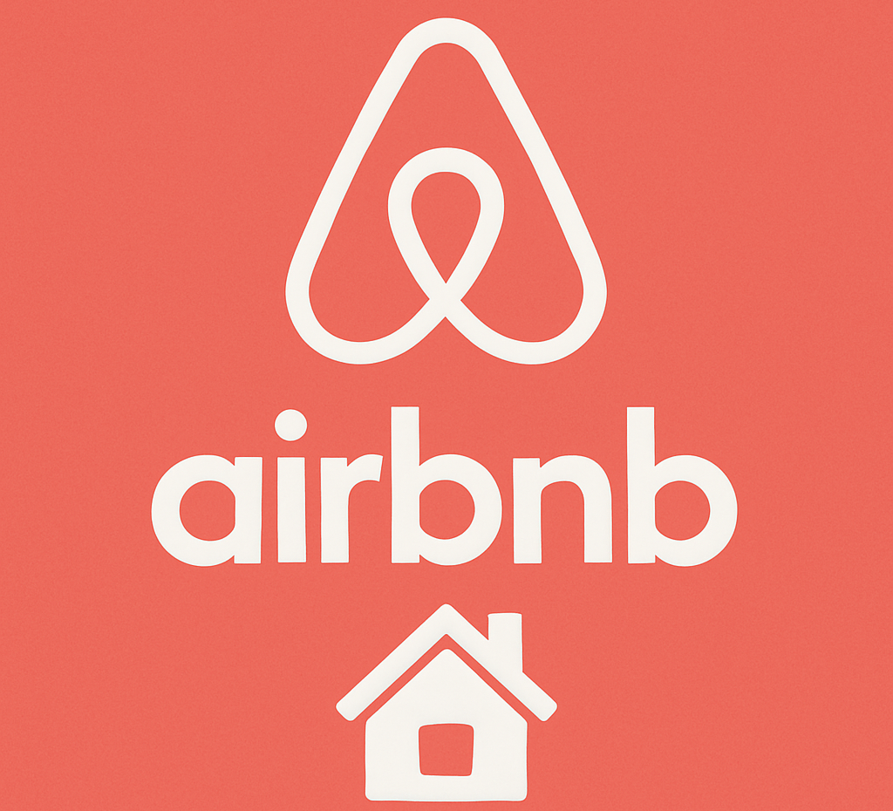

# Airbnb Listings & Reviews – Impact of Regulations

---

## 🚀 Project Link

[Airbnb Impact of Regulations](https://www.kaggle.com/code/samarthharde/airbnb-project)

---

## 📌 Overview
This project analyzes Airbnb listings and reviews data to understand how government regulations have affected the short-term rental market in major cities.

Airbnb is a platform that allows people to rent out their properties to travelers. Over the years, the platform has grown rapidly, but with growth came regulations. This project explores how these regulations have impacted the number of listings and their pricing.

---

## 📂 Dataset

This project uses Airbnb data for **250,000+ listings** across **10 major cities** and over **5 million guest reviews**.

- **listings.csv**: Contains detailed information about each listing (host, location, pricing, room type, etc.).
- **reviews.csv**: Includes guest reviews (review text, date, reviewer details).

**Source**: [Airbnb Listing and Review Dataset](https://www.kaggle.com/datasets/mysarahmadbhat/airbnb-listings-reviews)

---

## 🛠 Technologies Used

- **Python**: Pandas, Matplotlib, Seaborn

---

## 📊 Insights

1. **Initial Growth**  
   Rapid growth in listings and prices after the launch due to early adoption.

2. **Market Saturation**  
   As Airbnb became more widely known, listings increased, but prices began to fall due to an oversupply.

3. **Regulatory Impact (2015)**  
   Regulations caused uncertainty, leading to a drop in listings and an increase in prices.

4. **Post-Regulation Recovery (2019)**  
   After regulatory stabilization, listings grew again, and prices fell due to higher supply.

---

## ✅ Recommendations

- **Monitor Local Regulations**  
  Stay ahead of potential regulations and prepare accordingly.

- **Limit Listings Per Area**  
  Prevent overcrowding and reduce the likelihood of government interference.

- **Strict Host Onboarding**  
  Ensure hosts meet quality standards and legal requirements to maintain customer trust.

- **Maintain User Experience**  
  Avoid service disruptions due to regulations, which can negatively affect brand perception.

